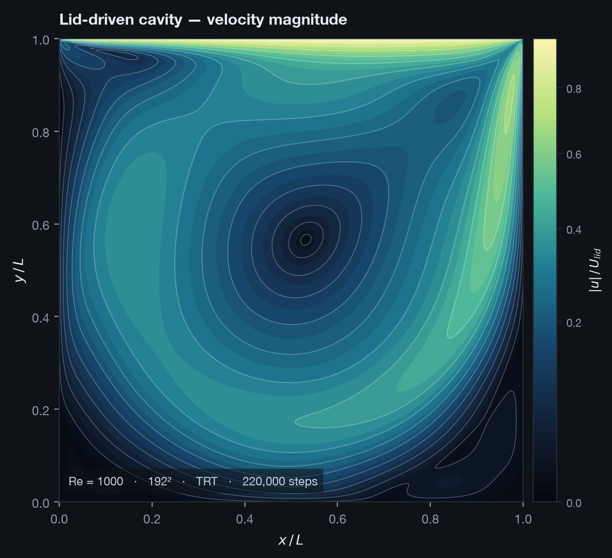
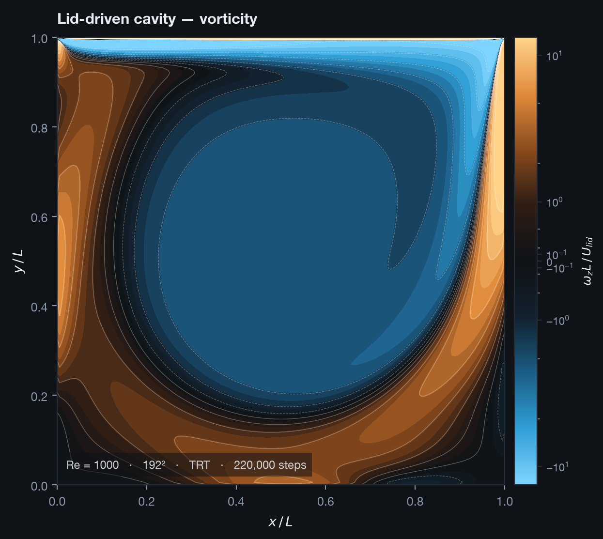
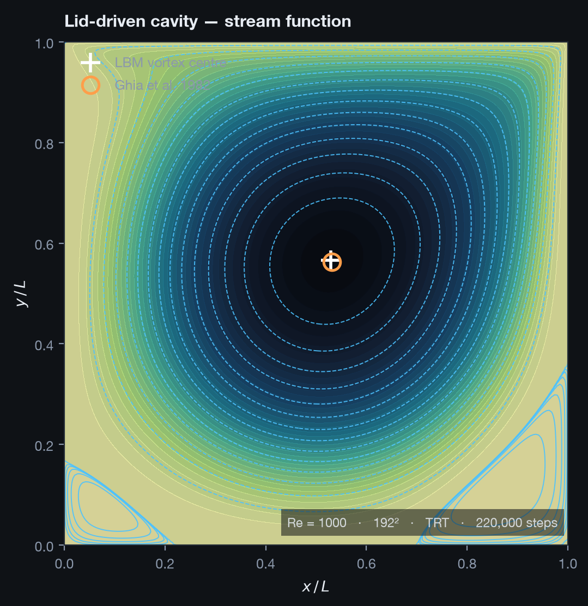
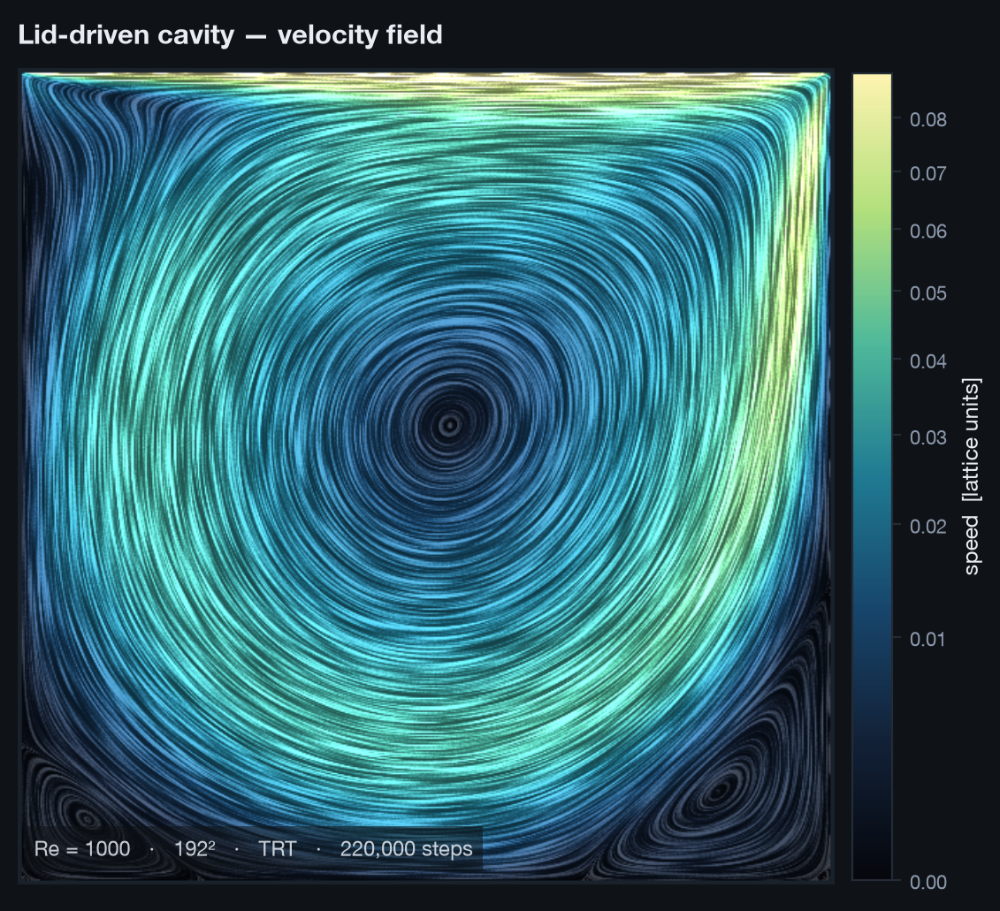
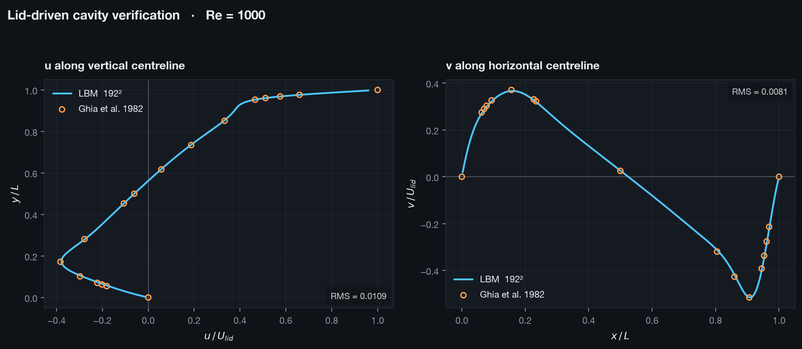
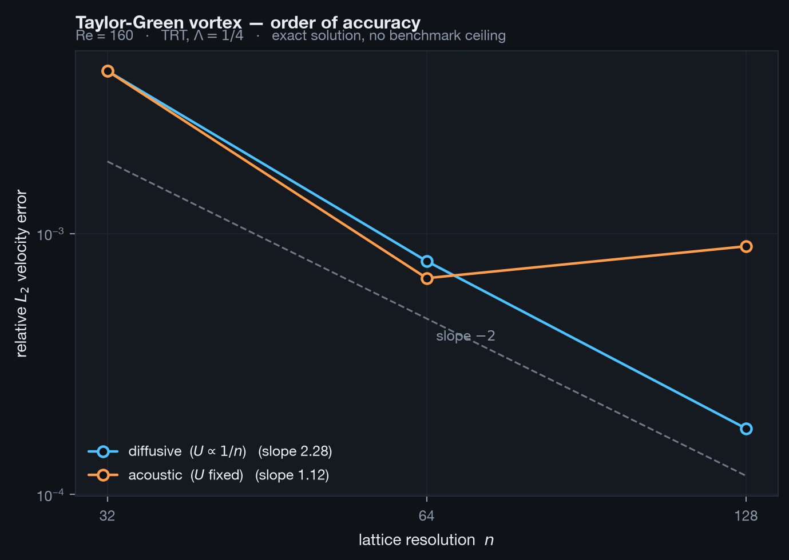

# Phase 0 — A verified 2D lattice Boltzmann core

**Status:** complete. 49 tests, ~3 s. Validated against Ghia et al. (1982) and against a
closed-form solution.

Phase 0 exists to answer one question: *is the physics right?* Everything after this —
the 3D GPU port, the surrogate models, the agent that sets cases up — is worthless if the
solver underneath is quietly wrong. So the deliverable is not a fast solver or a pretty
one. It is a slow, readable, pure-NumPy solver whose correctness has been pinned down hard
enough that it can serve as the oracle every later version is tested against.

---

## 1. The main ideas

### Why lattice Boltzmann, not finite volume

LBM streams particle distributions along a fixed Cartesian lattice and relaxes them toward
equilibrium. The macroscopic Navier–Stokes equations emerge from that; you never assemble
them. Three consequences decide the whole project:

- **No mesh generation.** The grid is a uniform array. Mesh generation is normally the
  single largest time sink in industrial CFD and the largest source of "why is my answer
  different from yours".
- **No implicit linear solve.** Streaming is a memory shift, collision is local. There is
  no pressure-Poisson system, no preconditioner, no convergence failure at the linear
  algebra level.
- **Trivially parallel.** Every cell updates from its own data plus one neighbour shift,
  which is exactly what a GPU wants.

The two hardest subsystems in a conventional CFD code are therefore skipped entirely. For a
solo project on nights and weekends, that is the difference between shipping and not.

There is a fourth reason that matters specifically here. A uniform Cartesian grid produces
dense tensors. Convolutional networks and Fourier neural operators consume those natively —
FNOs in fact *require* a uniform grid. An unstructured finite-volume mesh would need
resampling before any of the hybrid-modelling work becomes possible. The choice of solver
is also a choice of ML substrate.

### Why TRT and not BGK

The single-relaxation-time BGK operator has a defect that matters enormously for this
application: with halfway bounce-back walls, the effective wall position depends on the
relaxation time τ. Since τ is set by viscosity, **the geometry silently moves when you
change Reynolds number.** A case validated at one Re degrades at another, and it looks like
a physics problem when it is a boundary-condition problem.

Two-relaxation-time collision splits each distribution into symmetric and antisymmetric
parts and relaxes them at different rates. Choosing the magic parameter

$$\Lambda = \left(\tfrac{1}{\omega^+} - \tfrac12\right)\left(\tfrac{1}{\omega^-} - \tfrac12\right) = \tfrac14$$

pins the wall exactly halfway between the solid node and its fluid neighbour, independent
of viscosity. Scale-up work means sweeping Reynolds number by construction, so this is not
a refinement — it is a prerequisite.

### Why the schema came before the solver

`lms.schema.case.Case` is a Pydantic model with `extra="forbid"` that describes a complete
simulation. It was written first, deliberately. The solver, the reports, the future ML
pipeline and the future agent all bind to that one contract rather than to each other.

This is what makes the eventual AI setup layer tractable. An agent cannot reliably drive a
CFD package it does not control. It *can* reliably fill in a schema that validates its own
output, rejects contradictions, and explains failures in physical language. The schema
already does this: it refuses creeping flow presented as turbulent, refuses an impeller
resolved by fewer than 20 cells (and tells you what to raise the resolution to), and
refuses an unbaffled vessel above Fr = 0.1 where surface vortexing invalidates the
single-phase assumption.

`Case.fingerprint()` hashes the physics and numerics while ignoring name, description and
tags. The same physics always gets the same ID, which is what makes a run cache and an ML
dataset index possible later.

---

## 2. Simulation setup

### The D2Q9 lattice

Nine velocities on a square lattice: one rest, four axis-aligned, four diagonal.

| quantity | value |
|---|---|
| lattice speed of sound | $c_s^2 = 1/3$ |
| weights | $4/9$ (rest), $1/9$ (axis), $1/36$ (diagonal) |
| relaxation time | $\tau = 3\nu + 1/2$ |

Equilibrium is the second-order expansion of Maxwell–Boltzmann,

$$f_i^{eq} = w_i \rho \left(1 + 3(\mathbf{e}_i\cdot\mathbf{u}) + \tfrac92 (\mathbf{e}_i\cdot\mathbf{u})^2 - \tfrac32 |\mathbf{u}|^2\right)$$

### The lid-driven cavity

The standard benchmark: a square box, no-slip on three walls, the top lid sliding in $+x$.
It is deceptively hard — the two upper corners are singular, the flow contains a strong
primary vortex plus weak secondary vortices in the lower corners whose strength spans
several orders of magnitude, and every published solution disagrees slightly in the corners.

| parameter | value | why |
|---|---|---|
| Reynolds number | 1000 | the hardest case Ghia tabulates with confidence |
| grid | 192 × 192 | cavity side is $n-2 = 190$ lattice units |
| lid velocity | 0.1 | lattice units; Ma ≈ 0.17 |
| collision | TRT, $\Lambda = 1/4$ | wall position independent of $\nu$ |
| $\tau$ | 0.5570 | from $\nu = U L / \mathrm{Re}$ |
| convergence target | $2\times10^{-7}$ relative change in $\|u\|$ | checked every 1000 steps |

The cavity side length is $n-2$, not $n$, because halfway bounce-back places the wall
midway between the solid ring and the first fluid layer. Getting this off by one is a
silent 1% error in Reynolds number.

Each step is: compute moments → zero velocity inside solids → collide → apply bounce-back
with moving-wall momentum injection → stream. Moving walls add
$6 w_i \rho_w (\mathbf{e}_i \cdot \mathbf{u}_{wall})$ to the reversed populations.

The solver refuses lid velocities above 0.15 outright, and raises a `FloatingPointError`
naming the likely cause if the density field goes non-finite, rather than emitting a wall
of NaN warnings.

---

## 3. Results

### Velocity magnitude



The primary vortex fills the cavity. The lid drives a thin high-speed layer along the top;
the interior is an order of magnitude slower. The nested contours around the core are
concentric and smooth, which is the first sign the solution is converged rather than merely
stopped.

### Vorticity



The large blue region is the physically important result: **the core rotates as a solid
body.** Measured over the central 40 × 40 cells, $\omega_z L/U = -2.02$ with a standard
deviation of **0.01**. That uniform-vorticity core is a genuine feature of high-Re cavity
flow, and reproducing it is a stronger statement than matching any single profile.

The orange wall layers reach $|\omega| \approx 80$ — forty times the core. This dynamic
range is why the colour scale is asinh (linear near zero, logarithmic in the tails) rather
than linear, and clipped at the 97th percentile. An earlier version of this figure clipped
at the 99.5th percentile, which let the lid boundary layer set the scale and rendered the
entire core as black background. The most meaningful structure in the flow was invisible.
That is recorded here because the same trap applies to the bulk circulation in a stirred
tank.

### Stream function



Iso-contours of $\psi$ (defined by $u = \partial\psi/\partial y$, $v = -\partial\psi/\partial x$)
are exact streamlines. The two markers are the computed vortex centre and Ghia's tabulated
value; they are essentially coincident. Contour levels are split — linear for the primary
vortex, geometric for the corner vortices — because the secondary structures are three
orders of magnitude weaker and uniform levels would not resolve them at all.

### Line integral convolution



LIC smears a noise texture along streamlines, so structure is visible *everywhere at once*.
Quiver plots and hand-seeded streamlines both misrepresent recirculation zones — they show
you only where you happened to look. The texture is generated at 3× grid resolution and
histogram-equalised; without both it aliases into grey mush.

---

## 4. Validation

Two independent checks, chosen because they fail in different ways.

### Against Ghia et al. (1982)

The reference is a 129² multigrid Navier–Stokes solution, Tables I and II.



| metric | LBM (192²) | Ghia (129²) | deviation |
|---|---|---|---|
| $u$ on vertical centreline | profile | Table I | RMS **0.0109** |
| $v$ on horizontal centreline | profile | Table II | RMS **0.0081** |
| primary vortex centre | (0.5289, 0.5658) | (0.5313, 0.5625) | **0.0040 L** = 0.8 cells |
| $\psi_{min}$ | −0.115954 | −0.117929 | **1.68 %** |

Run for 220,000 steps in 1189.6 s (185 steps/s). Note that this run **stopped at its step
cap rather than reaching the $2\times10^{-7}$ tolerance** — the reported errors are
therefore an upper bound, and a fully converged run would agree at least this well.

The vortex-centre and $\psi_{min}$ checks matter more than they might appear. Centreline
profiles are a 1D slice; a solver can match both while putting the recirculation in the
wrong place. Locating the vortex to within 0.8 cells is a geometric statement the profiles
cannot make.

### Grid refinement on the cavity

Three resolutions at Re = 1000, all under the same conditions:

| $n$ | steps | status | wall time | RMS $u$ | RMS $v$ | $\psi_{min}$ error | vortex offset |
|---|---|---|---|---|---|---|---|
| 96 | 133,000 | converged | 140 s | 0.0245 | 0.0170 | 4.90 % | 0.84 cells |
| 128 | 176,000 | converged | 310 s | 0.0173 | 0.0117 | 3.18 % | 0.83 cells |
| 192 | 220,000 | hit step cap | 1190 s | 0.0109 | 0.0081 | 1.68 % | 0.76 cells |

Every error metric falls monotonically. But the *rate* is the interesting part — fitting
error against resolution gives an observed order of **1.17** for $u$, **1.06** for $v$ and
**1.55** for $\psi_{min}$. For a scheme that should be second order, that is wrong enough
to worry about, and it is what motivated the Taylor–Green study below.

One detail worth pausing on: the vortex-centre offset is ~0.8 cells at *every* resolution.
It is constant in cells, not in $L$. That is the expected signature of locating an extremum
by `argmin` over a discrete field — the accuracy is bounded by grid spacing, so it is not
evidence of a physics error. Sub-cell localisation would need a parabolic fit around the
extremum.

**Ghia is not ground truth.** It is a 1982 solution on a 129² grid with its own error bar,
and agreement to ~1% is approximately where its own accuracy runs out. This is why the
second check exists.

### Against a closed-form solution

The decaying Taylor–Green vortex is an exact solution of incompressible Navier–Stokes:

$$u = -U\cos(kx)\sin(ky)e^{-2\nu k^2 t}, \qquad v = U\sin(kx)\cos(ky)e^{-2\nu k^2 t}$$

Periodic, so it isolates collision and streaming from the boundary conditions, and exact,
so there is no benchmark ceiling.



This resolved the open question from the grid refinement above. That apparent order of ~1.1
looked like a broken solver. It was a broken *measurement*:

| | 32 | 64 | 128 | fitted order |
|---|---|---|---|---|
| **diffusive** ($U \propto 1/n$, $\tau$ fixed) | 4.196e−3 | 7.837e−4 | 1.791e−4 | **2.28** |
| **acoustic** ($U$ fixed, $\tau \propto n$) | 4.196e−3 | 6.743e−4 | 8.934e−4 | **1.12** |

Same solver, same code path, same physical problem. The difference is only how the grid is
refined.

LBM's compressibility error scales as $\mathrm{Ma}^2$. Holding lattice velocity fixed while
refining holds the Mach number fixed, so that error becomes a **floor that refinement
cannot cross**. Worse, at fixed Reynolds number, holding $U$ fixed forces $\nu$ — and hence
$\tau$ — to grow with $n$. Past a point refining actively makes the answer worse, which is
visible above: the 128² acoustic error is *larger* than the 64².

Diffusive scaling (halve $U$ when doubling $n$) holds $\tau$ and Re fixed and drives
Ma → 0 like $1/n$, so the compressibility error falls at the same second-order rate as the
discretisation error. The solver then shows its true order.

The fitted 2.28 sits slightly above 2 because the coarsest grid is not yet asymptotic —
local orders are 2.42 (32→64) and 2.13 (64→128), converging toward 2 as expected.

This closes the loop on the cavity table. That study held $U = 0.1$ at all three
resolutions — acoustic scaling — and measured 1.17. The acoustic column here measures 1.12
on a problem with a known exact answer. **The cavity was never showing a solver defect; it
was showing the Mach floor**, and the agreement between 1.17 and 1.12 is the evidence.

**This governs every future mesh study.** A 3D grid-refinement study run under acoustic
scaling would produce a first-order result and days of chasing a bug that is not there.

---

## 5. Test suite

49 tests, ~3 s. The suite is written to catch physics errors, not to chase coverage.

| file | n | what it pins down |
|---|---|---|
| `test_lbm2d.py` | 26 | lattice isotropy, equilibrium moments, TRT magic parameter, mass conservation, stream function 2nd-order accuracy, Taylor–Green order of accuracy |
| `test_schema.py` | 11 | scale-invariance of the feature vector, fingerprint stability, physics-aware rejections |
| `test_viz.py` | 13 | LIC texture anisotropy, norm centring, colour-scale behaviour on weak uniform cores |

Three deserve comment.

**`test_second_moment_is_isotropic`** asserts $\sum_i w_i e_{i\alpha} e_{i\beta} = c_s^2\delta_{\alpha\beta}$.
Without it the recovered macroscopic equations are not Navier–Stokes. A wrong weight would
still conserve mass and still look plausible.

**`test_feature_vector_is_scale_invariant`** asserts that a 10× vessel at matched Reynolds
number produces an identical feature vector. This is the property the entire scale-up
surrogate depends on; if it breaks, models trained at bench scale cannot transfer.

**`test_acoustic_scaling_stalls_on_the_mach_error_floor`** asserts the *failure* documented
above. It exists so the trap stays in executable form rather than in a comment someone
deletes.

The suite also contains a deliberate divergence test that took three attempts to write
correctly. Uniform flow at high velocity is stable (no gradients). Alternating shear bands
are *also* stable, because a 1D shear layer has a vanishing nonlinear term and is linearly
stable at any viscosity. Only after adding a transverse perturbation — making it a genuine
Kelvin–Helmholtz instability — did it diverge, at step 506. The same trap will reappear in
3D turbulence-transition tests, so the reasoning is recorded in the test docstring.

---

## 6. Honest limitations

- **2D only.** Real mixing is three-dimensional; 2D turbulence has the wrong energy cascade.
  Phase 0 was never meant to produce engineering answers.
- **Pure NumPy, single-threaded.** 185 steps/s at 192², 949 at 96². Cost scales roughly with
  cell count, and time-to-steady-state grows on top of that. This is the oracle, not the
  product.
- **The 192² run did not reach tolerance.** It stopped at a 220,000-step cap. The 96² and
  128² runs did converge, which is why they are the cleaner data points despite being
  coarser.
- **No turbulence model.** Re = 1000 is laminar. LES arrives with the 3D port.
- **Ghia only certifies to ~1 %.** The Taylor–Green study is the real accuracy statement.
- **No manufactured-solution verification yet.** Taylor–Green covers the bulk scheme, but
  the boundary conditions are still only validated against a benchmark, not verified against
  an exact solution.
- **`cases/examples/rushton_standard.yaml` is aspirational.** The schema describes stirred
  tanks; the 2D solver cannot yet run one.

---

## 7. What Phase 0 establishes for Phase 1

| asset | why it matters next |
|---|---|
| Verified 2D solver | the oracle the GPU kernels are tested against, cell by cell |
| Case schema | the contract the agent will fill; already rejects bad physics |
| Diffusive scaling result | prevents a wasted 3D convergence study |
| Visual language | asinh norms, LIC, contour conventions all transfer to 3D slices |
| Ghia + Taylor–Green harness | the regression net that catches a wrong GPU kernel |

Phase 1 is the 3D GPU port: D3Q19, MRT or cumulant collision, Smagorinsky LES, STL
voxelisation, and an immersed boundary for the rotating impeller — ending at the Rushton
power number milestone, $N_p$ within ~10 % of the published 4.8–5.5.

---

## Reproducing

```bash
pip install -e ".[dev]"

pytest -q -m "not slow"                                      # 49 tests, ~3 s

python scripts/validate_cavity.py --n 96  --reynolds 1000    # ~2.5 min, converges
python scripts/validate_cavity.py --n 128 --reynolds 1000    # ~5 min,   converges
python scripts/validate_cavity.py --n 192 --reynolds 1000    # ~20 min,  hits step cap

python scripts/render_cavity.py runs/cavity/state_re1000_n192.npz
python scripts/convergence_study.py --sizes 32 64 128        # ~35 s
```

Figures land in `runs/`, which is gitignored. The curated set is committed to
`docs/figures/`.

### References

Ghia, U., Ghia, K. N. & Shin, C. T. (1982). High-Re solutions for incompressible flow using
the Navier–Stokes equations and a multigrid method. *J. Comput. Phys.* **48**, 387–411.

Ginzburg, I., Verhaeghe, F. & d'Humières, D. (2008). Two-relaxation-time lattice Boltzmann
scheme. *Commun. Comput. Phys.* **3**, 427–478.
