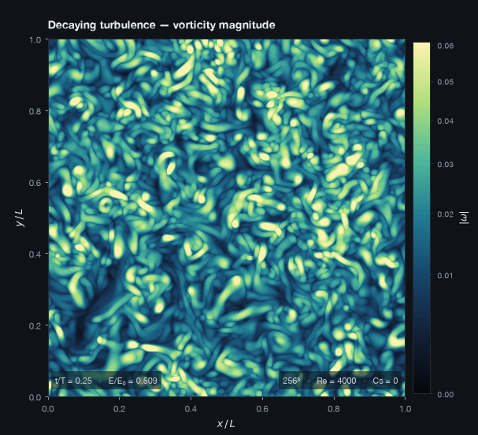
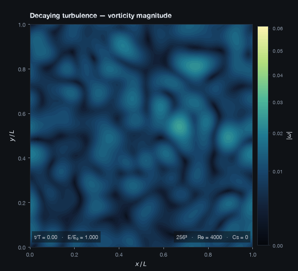
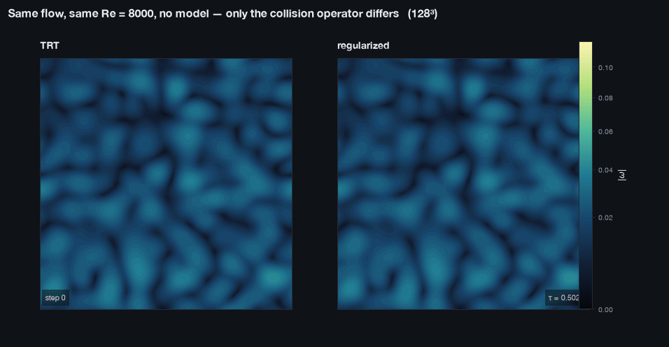
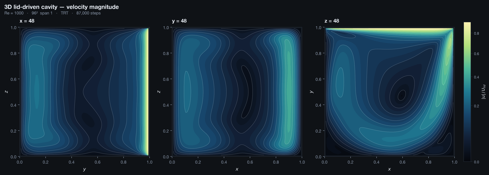
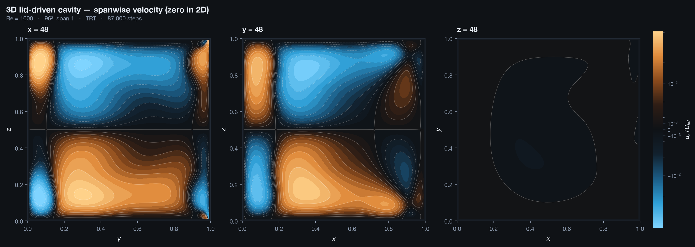
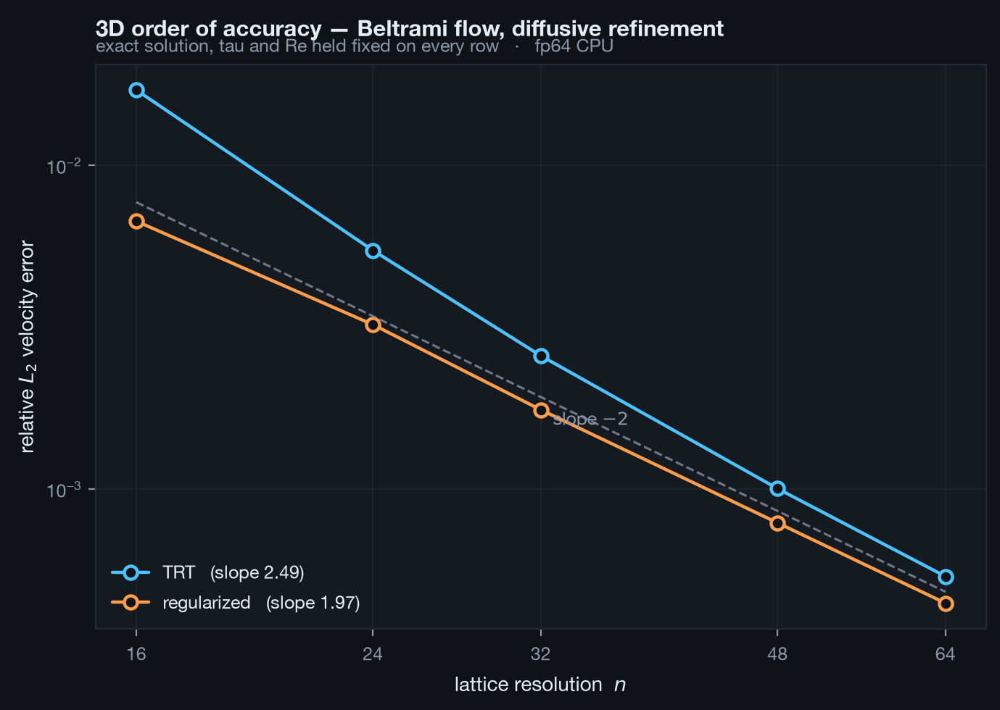
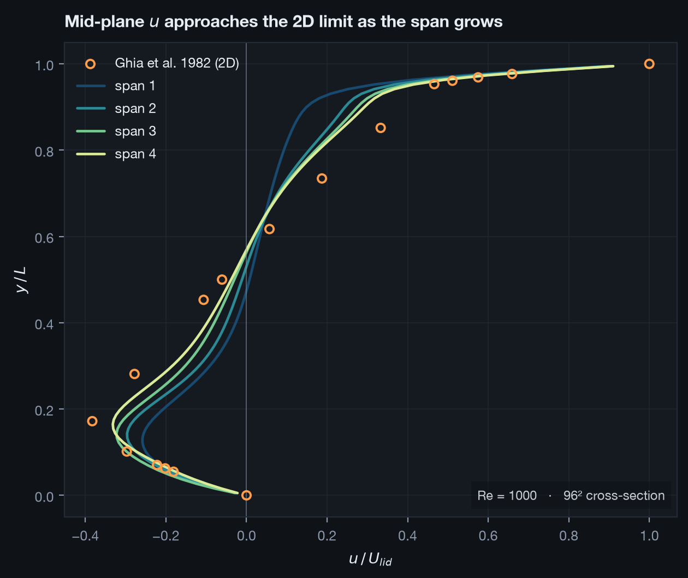
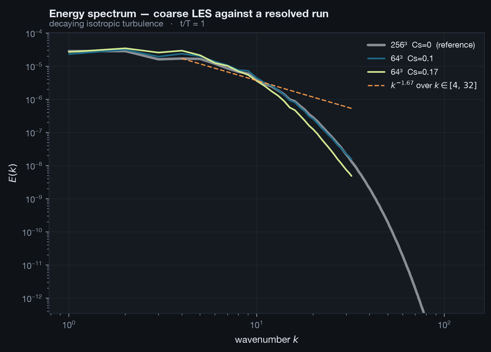

# Phase 1 — A 3D lattice Boltzmann solver on the GPU

Phase 0 produced a verified 2D solver: pure NumPy, 185 steps/s at 192², second-order
accurate, matching Ghia to about 1%. It was always the oracle, never the product.

Phase 1 turns it into something that could plausibly simulate a stirred tank. It is
**not** a stirred-tank solver yet — there is no geometry in it, no impeller, no walls
beyond a box. What it is: three-dimensional, running on the GPU at 584 MLUPS, verified
against an exact solution to second order, carrying a turbulence model, and stable at
relaxation times where the scheme it started from tears itself apart.

It arrives in three parts.

| | what it added | the number that says it worked |
|---|---|---|
| **1a** | D3Q19 on Metal via Taichi | reproduces the 2D oracle to 3.2×10⁻¹⁴ in fp64 |
| **1b** | Smagorinsky LES | strain rate from populations, order 1.99 against analytic |
| **1c** | Regularized collision | unmodelled, resolved turbulence at Re_λ > 30 |

**Cost: nothing.** Taichi is Apache-2.0 and the M4 Pro's 20-core GPU runs it natively.
No cloud, no NVIDIA, no licences.

---

## 1. The main ideas

### Verify against things with known answers, in that order

Every check in Phase 1 was chosen so that failure has exactly one interpretation.

The strongest is the cheapest. Run the 3D solver on a cavity that is uniform in `z` and
compare it **cell by cell** against the 2D solver Phase 0 already verified. Same physics,
same initial condition, a known-correct reference. In fp64 it agrees to 3.2×10⁻¹⁴ —
machine precision. Anything worse would have been a porting bug with nowhere to hide, and
no physics ambiguity to argue about.

Only after that comes an exact solution the 2D code never saw (Beltrami), and only after
*that* a benchmark with its own error bar.

### The GPU is a memory system, not a calculator

LBM is bandwidth-bound. D3Q19 with double buffering moves 19 reads and 19 writes per cell
per step — 152 bytes in fp32 — so the achievable rate follows from memory bandwidth, and a
MLUPS figure means nothing without the ceiling beside it. The M4 Pro peaks near 273 GB/s,
giving a hard limit of about 1.8 GLUPS.

This framing paid for itself immediately, and is the reason the layout question got the
right answer (§4).

### fp32 is a decision, not a default

Metal has no float64 at all — Taichi rejects it in its SPIR-V builder. So the GPU path is
fp32 and the CPU path is fp64, deliberately: the fp64 path exists so that a precision
effect can be told apart from a bug, which is only possible if one of the two is exact
enough to be the reference. That distinction resolved three separate confusions in this
phase.

Populations are stored as `f - wᵢ` rather than `f`. A population sits at O(0.01–0.3) while
the non-equilibrium part carrying all the physics is O(10⁻⁶); with seven significant
digits, storing `f` directly puts the interesting part within a couple of digits of the
rounding noise.

### Measure before adding

Phase 1b was scoped as "LES only, measure where TRT actually breaks" rather than
"LES and MRT". The measurement (§5) said unmodelled TRT dies above τ ≈ 0.519, which
justified Phase 1c — and then said regularization was enough, so the 19×19 moment
transform MRT would have required was never written. The discipline saved the work.

---

## 2. Setup

### The D3Q19 lattice

Nineteen velocities: one rest, six along the axes at weight 1/18, twelve along face
diagonals at 1/36. The eight corner directions of D3Q27 are omitted — standard for
wall-bounded incompressible flow, 30% cheaper in memory and bandwidth.

Velocities are ordered in opposite pairs, so `OPPOSITE[i]` is arithmetic rather than a
lookup. Bounce-back indexes by it on every solid node of every step.

`viscosity_to_omega` and `trt_magic_omega` are reused unmodified from the 2D code. They
are statements about relaxation rates, not lattice geometry, so the magic parameter that
pins the bounce-back wall halfway between nodes *independent of viscosity* carries over
verbatim.

### Collision operators

Three, added in the order the evidence demanded:

- **TRT** — what Phase 0 verified. Ported first precisely so that a mismatch against the
  oracle could only be a porting bug.
- **Smagorinsky LES** on top, with a per-cell relaxation time.
- **Regularized** — rebuilds the whole non-equilibrium part from its momentum flux,
  discarding every higher Hermite moment. Those discarded pieces are the ghost modes: no
  hydrodynamics, but they carry the instability that kills LBM as τ → 1/2.

### Streaming

Pull, into a second buffer. The simplest thing that is correct. In-place patterns (AA,
Esoteric Twist) halve memory and are the route to 512³, but they make every intermediate
state harder to reason about and belong after the kernel is trusted.

---

## 3. Results

### Turbulence, unmodelled and resolved



Decaying isotropic turbulence at 256³, Re = 4000, **no turbulence model**. Vorticity
magnitude on a mid-plane. This is the run Phase 1b could not produce: Re_λ above 30 for
its entire duration *and* `k_max·η ≥ 1.28` throughout, so it is resolved as well as
turbulent.

Vorticity magnitude is non-negative, so it is drawn on a sequential map. That sounds like
a detail; §7 explains why it is not.



Two eddy turnovers. Energy falls to 1.6% of its initial value, and the caption carries
`E/E₀` so the fade reads as decay rather than as a rescaling colour bar — the scale is
pooled across every frame and frozen.

This is the first genuinely time-dependent animation in the project. Phase 0's Reynolds
sweeps had to be honest about being a walk through parameter space, because the 2D cavity
is steady.

### Why Phase 1c exists, in one figure



Identical initial field, identical Re = 8000, no turbulence model, τ = 0.5024. The only
difference is the collision operator. TRT diverges by step 240; regularized runs to 2400
and keeps going.

The colour scale is fitted to the survivor and frozen. Pooling it over both runs would
have let the blow-up's excursion set the scale and rendered the healthy run as a flat dark
square — which would read as "nothing much happened either way". The dead panel stops and
says *diverged*, rather than painting NaNs or holding a stale frame.

### The 3D cavity



Three centre planes on one shared colour scale, Re = 1000. A single slice through a 3D
field is a claim the slice cannot support, so all three are shown.



The spanwise velocity `u_z`, which is **identically zero in 2D**. Every feature here is
something the Phase 0 solver could not have produced: the end walls drive Taylor–Görtler
vortices that drag the mid-plane circulation down. This is signed, so it gets the
diverging map.

---

## 4. Verification and validation

### Against the 2D oracle

Cavity uniform in `z`, compared cell by cell:

| backend | max abs difference | relative |
|---|---|---|
| CPU fp64 | 3.2×10⁻¹⁴ | 3.5×10⁻¹³ |
| Metal fp32 | 7.3×10⁻⁷ | 8.2×10⁻⁶ |

fp64 reproduces the oracle to machine precision, so the kernel is algorithmically
identical rather than merely close. Density matches separately to 1.1×10⁻¹³, because
getting velocity right while getting pressure wrong is a real failure mode.

**fp32 costs 8×10⁻⁶ relative — about a thousandth of the discretisation error the cavity
already carries against Ghia (≈2×10⁻²).** That measurement, not an assumption, is what
justifies running production in single precision.

### Order of accuracy on an exact solution



**The 3D Taylor–Green vortex is not an analytic solution.** In 2D the nonlinear term
vanishes, which is what made Phase 0's Taylor–Green exact; in 3D it does not, and the 3D
TGV is a transition benchmark with reference DNS data rather than a closed form. Reaching
for it by name would have quietly traded an exact solution for a comparison against
somebody else's simulation.

The ABC (Beltrami) flow is exact. It is divergence-free by inspection, and `curl u = k u`,
so `u × curl u = 0`, so the nonlinear term is a pure gradient absorbed into the pressure.
What remains is a heat equation and the field decays as a single exponential. All three
velocity components are non-trivial, which exercises the `z` streaming direction the
extruded cavity cannot reach.

Refined diffusively (τ and Re fixed, Ma ∝ 1/n) because Phase 0 established the hard way
that acoustic refinement pins the Mach number and reports order ~1.1 for a scheme that is
genuinely second order:

| n | Ma | TRT error | regularized error |
|---|---|---|---|
| 24 | 0.0866 | 7.94×10⁻³ | 3.22×10⁻³ |
| 48 | 0.0433 | 1.17×10⁻³ | 7.85×10⁻⁴ |
| 96 | 0.0217 | 2.46×10⁻⁴ | — |
| **fitted order** | | **2.25** | **1.97** |

Both second order. Regularized is the better-behaved of the two, approaching 2 from below
with local orders 1.81, 2.11, 1.98, 1.99, where TRT approaches from above.

### Getting the initial condition right cost two corrections

The first Beltrami ladder gave orders wandering 2.97 → 1.99 → 1.25 → 1.65. That was the
harness, not the solver.

1. **Equilibrium-only initialisation discards the strain rate.** Adding the first-order
   Chapman–Enskog term made it 25× more accurate after a single step and collapsed two
   competing error sources into one.
2. **That term needs a factor of (1 − ω)**, because the buffers hold *post-collision*
   populations. With ω ≈ 1.9 the factor is negative, so omitting it applies the initial
   stress backwards — the errors got *worse* when the term was first added, which is what
   exposed it.

The sign was pinned empirically (one step, 25× better with it, 2× worse against it) rather
than trusted from the algebra.

### The 3D cavity: symmetry and the 2D limit

The usual references for the 3D cavity are Ku, Hirsh & Taylor (1987) and Albensoeder &
Kuhlmann (2005). **Their tables are not in this repository and were not reproduced from
memory.** `ghia.py` exists because those numbers were transcribed from the paper;
inventing a plausible-looking table would poison every comparison made against it
afterwards. So the 3D cavity is validated against two things that could be established
honestly.

**Symmetry that is never imposed.** A cubic cavity with a lid sliding along `+x` is
mirror-symmetric about mid-span. Nothing in the solver knows that. Measured residuals stay
at 10⁻⁵–10⁻⁶ and do not drift as the domain grows fourfold.

**The two-dimensional limit.**



| span | RMS u vs Ghia | RMS v |
|---|---|---|
| 1 | 0.1050 | 0.1029 |
| 2 | 0.0748 | 0.0705 |
| 3 | 0.0585 | 0.0544 |
| 4 | 0.0480 | 0.0470 |

As the span grows the mid-plane stops feeling the end walls and must approach the 2D
solution, which is already validated against Ghia. It does, monotonically in both
components. Extrapolating `A + B/span` gives 0.0334 against the 2D solver's measured
0.0245 — the right neighbourhood, but **the gap is real and unexplained**, and four points
from Λ = 1–4 cannot pin an asymptote that precisely. This is not a quantitative match and
is not claimed as one.

### The wall did not move

Regularization's reconstruction uses `e_ia e_ib`, which is even under `i → OPPOSITE[i]`,
so the rebuilt non-equilibrium part is purely symmetric and the antisymmetric part is
zeroed. That is exactly what TRT's magic parameter relaxes, and Λ = 1/4 pinning the
bounce-back wall independent of viscosity has been load-bearing since Phase 0. So
regularizing might have moved the wall.

Extruded cavity against Ghia, which removes the end-wall confound:

| Re | τ | 2D TRT | 3D TRT | 3D regularized |
|---|---|---|---|---|
| 100 | 0.7820 | 0.0090 | 0.0090 | 0.0091 |
| 400 | 0.5705 | 0.0145 | 0.0145 | 0.0142 |
| 1000 | 0.5282 | 0.0245 | 0.0245 | **0.0220** |

3D TRT reproduces the 2D oracle exactly at every Reynolds number. Regularized does not
degrade as τ falls toward 0.5 — it improves, by 10% at Re = 1000 where the concern would
have bitten hardest. Symmetry residuals are about twice as clean too.

### The LES model

The strain rate comes from the populations, with no finite differences: Phase 1a proved
`Σᵢ e_ia e_ib f_i^neq = −2τρcs²S_ab`, so inverting it gives `S_ab` locally and free. The
computed strain matches `beltrami.analytic_strain` to second order (1.99).



A coarse LES run tracked against a resolved run of the same flow, compared mode by mode
because the two grids sample the same box differently. Cs = 0.1 tracks the reference to
14% mean deviation over the shared scales; Cs = 0.17 to 27%, visibly over-dissipating.
`Cs = 0` reproduces the laminar solver exactly, which is the regression the whole LES path
rests on.

---

## 5. Performance

| grid | MLUPS | % of the 273 GB/s ceiling |
|---|---|---|
| 64³ | 33 | 1.9% |
| 128³ | 225 | 12.6% |
| 192³ | 475 | 26.5% |
| 256³ | 584 | 32.5% |

584 MLUPS at 256³ is essentially what a pure streaming kernel achieved with no collision
at all — the expected signature of a memory-bound scheme. Against Phase 0's 6.8 MLUPS
that is about **86× per cell-update**. Small grids are launch-overhead bound, so
benchmarks start at 128³.

### Where TRT actually breaks

At n = 64, no turbulence model:

| Re | τ | TRT | regularized |
|---|---|---|---|
| 500 | 0.5192 | survives | survives |
| 1000 | 0.5096 | **died @200** | survives |
| 32000 | 0.5003 | died | survives |
| 512000 | 0.5000 | died | survives |

TRT dies above Re = 500. Regularized reaches τ = 0.5000 — the floor — with no model at
all. But **survival is not the same as being right**: at those extremes `k_max·η` falls to
0.02, meaning the grid cannot represent the scales where dissipation happens. A solver
that survives there has not simulated turbulence, it has failed to crash. Both numbers are
reported together for that reason.

---

## 6. Test suite

145 tests, about 20 seconds. The ones worth naming:

- **Lattice moments** — weights sum to 1, second moment exactly 1/3, fourth-moment
  isotropy, `OPPOSITE` an involution with `e[OPPOSITE[i]] == -e[i]`. A wrong velocity set
  does not crash; it produces a solver that is quietly wrong about viscosity.
- **The extruded oracle** — fp64 agreement with the 2D solver to 10⁻¹².
- **Regularization is a projection** — idempotent, preserves `Π_ab`, leaves mass and
  momentum untouched, and is bit-for-bit the identity on `beltrami.nonequilibrium()`,
  which already returns the second-order Hermite form.
- **Dissipation uses physical wavenumbers** — added after the bug in §7, asserting both
  agreement with a direct `2ν⟨S_ab S_ab⟩` computation and that the shell-index form is
  wrong by exactly `(n/2π)²`.
- **End walls break the 2D solution** — the first assertion in this project that 3D says
  something 2D cannot.

---

## 7. Honest limitations, and four things that were wrong

### k⁻⁵ᐟ³ was not achieved

Measured slopes run −3.5 to −4.6 even at Re_λ = 165 with `k_max·η > 1`.

The cause is the test case, not the solver, and this is demonstrable: the synthetic
initial spectrum has a Gaussian roll-off whose local slope over k = 8–40 is about −115, so
the high-wavenumber range must be *built* by the cascade. It demonstrably is being built —
−115 to −3.55 after one turnover — but two turnovers of a decaying flow is not enough to
reach −5/3 while the energy drains. A developed inertial range needs forced turbulence,
which is a different case, not a better solver.

**Phase 1b gave a different and wrong explanation for this**, claiming the flow "was never
turbulent" at Re_λ ≈ 4. That Re_λ was wrong (below), and the run was near Re_λ ≈ 160.

### The dissipation rate was wrong by (n/2π)²

`dissipation_rate` used the integer shell index where it needed the physical wavenumber
`2πm/n`. That inflated ε by a factor of 101 at n = 64 and 1660 at n = 256, and dragged
everything derived from it — Taylor microscale, Re_λ, Kolmogorov scale — down by `n/2π`.

Every Re_λ reported during Phase 1b was therefore **about 10–40× too low**. Caught by
comparing against an independent `2ν⟨S_ab S_ab⟩` computation, which now agrees to 2%.

### A magnitude was drawn on a diverging colormap

`|ω|` is non-negative by construction, but was rendered on the dark-centred diverging map
with a symmetric norm. The colorbar advertised values down to −10⁻³ that cannot exist,
half the colormap was dead, and the quiet majority of the box sat on the neutral midpoint.

`style.py` opens by stating that diverging fields get a symmetric scale about zero. The
rule existed; it was applied to a field that does not diverge. This is why
`.claude/skills/figure-style/SKILL.md` now exists.

### Every 3D run reported false failure

The convergence residual is a *relative change*, so it cannot fall below the rounding
noise producing it. In fp32 it floors at 1.1×10⁻⁵; fp64 keeps falling past 10⁻¹². A
tolerance of 10⁻⁶ is therefore unreachable in single precision **by construction**, and
every run burned its full step budget before declaring failure on a field that had stopped
changing.

Confirmed by brute force: 900,000 steps gave the same profile as 250,000 to four decimal
places. Fixed with stagnation detection — the span-1 cavity now finishes in 87,000 steps
and 63 seconds instead of 900,000 and 648, returning identical results.

### Standing limitations

- **No geometry.** A box with walls. No STL, no baffles, no impeller.
- **The 3D cavity has no published reference.** Ku or Albensoeder tables would close it.
- **Smagorinsky does not vanish at walls.** Fine for isotropic turbulence, wrong near a
  boundary; a stirred tank will need van Driest damping or a dynamic model.
- **The span extrapolation gap** (0.0334 against 0.0245) is unexplained.
- **fp32 everywhere on GPU.** Not shown to be a limit, but not ruled out at τ → 0.5.
- **Taichi's upstream development slowed after 2023**, and its Metal backend is less
  exercised than CUDA. Keeping the physics in plain NumPy modules with Taichi confined to
  the kernel layer preserves an escape hatch.

---

## 8. What Phase 1 establishes for Phase 2

| asset | why it matters next |
|---|---|
| 3D GPU solver at 584 MLUPS | the Rushton case is minutes, not hours |
| Regularized collision | stable at τ → 0.5, which stirred-tank Reynolds numbers require |
| LES with a verified strain rate | the closure a turbulent tank needs |
| Beltrami harness | catches a wrong kernel as an order-of-accuracy failure |
| `k_max·η` diagnostic | distinguishes "resolved" from "survived" |
| Figure-style skill | the visual standard is now a versioned artifact |

Phase 2 is geometry: STL voxelisation, an immersed boundary, a rotating impeller, and the
Rushton power number within ~10% of the published 4.8–5.5. Everything in it is about
putting objects into a flow that now works.

> **What actually happened** — see [phase2.md](phase2.md). The tank proved fully
> parametric, so neither STL nor IBM was built; the rotating impeller runs as an
> analytic in-kernel solid with Bouzidi sub-cell walls. The power number came out on
> the published curve at Re 50 and 500 but 28% below the band at Re 5×10⁴ — a miss
> anatomised down to one remaining suspect (trailing-vortex resolution, band near
> n ≈ 1000) through eleven eliminated hypotheses and a momentum-ledger audit that
> caught a real torque-meter bug along the way.

---

## Reproducing

```bash
pip install -e ".[gpu,dev]"

pytest -q -m "not slow"                                       # 145 tests, ~20 s

python scripts/verify_extruded.py                             # 3D vs the 2D oracle
python scripts/convergence_beltrami.py --sizes 24 32 48 64    # order ~2
python scripts/validate_cavity3d.py --n 96 --spans 1 2 3 4    # symmetry, 2D limit
python scripts/benchmark_mlups.py                             # vs the 273 GB/s ceiling
python scripts/les_stability.py --n 64 --collision regularized
python scripts/decaying_turbulence.py --n 256 --reynolds 4000 \
    --collision regularized --smagorinsky 0 --turnovers 2     # the acceptance run
python scripts/animate_stability.py --n 128 --reynolds 8000
```

Figures land in `runs/`, which is gitignored. The curated set is in `docs/figures/`.

### References

Latt, J. & Chopard, B. (2006). Lattice Boltzmann method with regularized pre-collision
distribution functions. *Math. Comput. Simul.* **72**, 165–168.

Ghia, U., Ghia, K. N. & Shin, C. T. (1982). High-Re solutions for incompressible flow
using the Navier–Stokes equations and a multigrid method. *J. Comput. Phys.* **48**,
387–411.

Smagorinsky, J. (1963). General circulation experiments with the primitive equations.
*Mon. Weather Rev.* **91**, 99–164.
