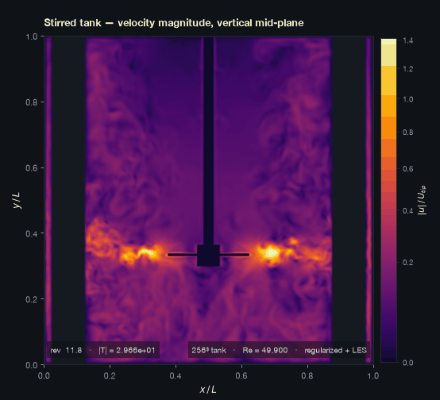
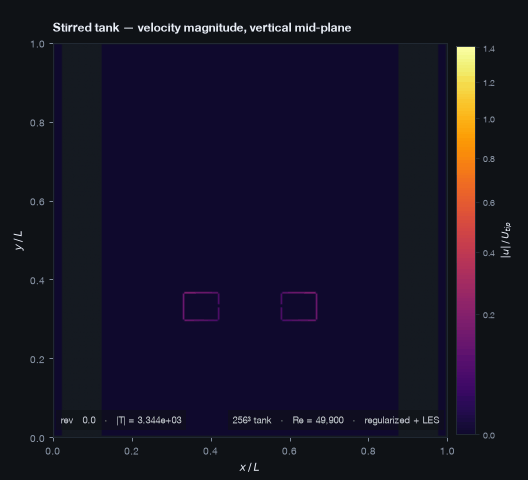
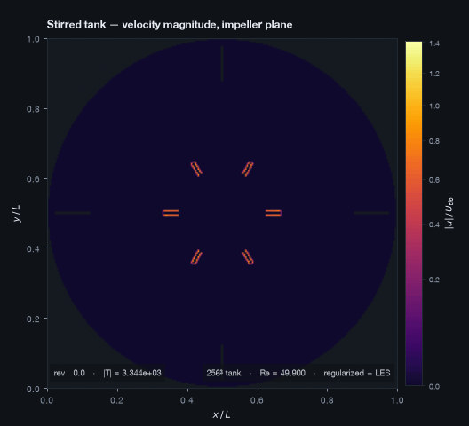
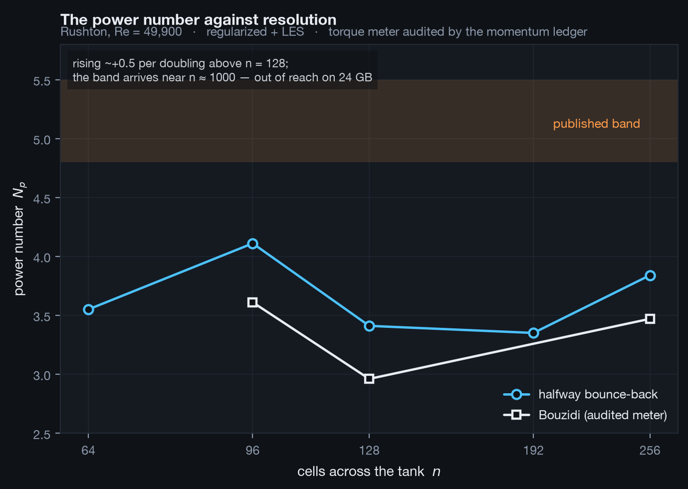
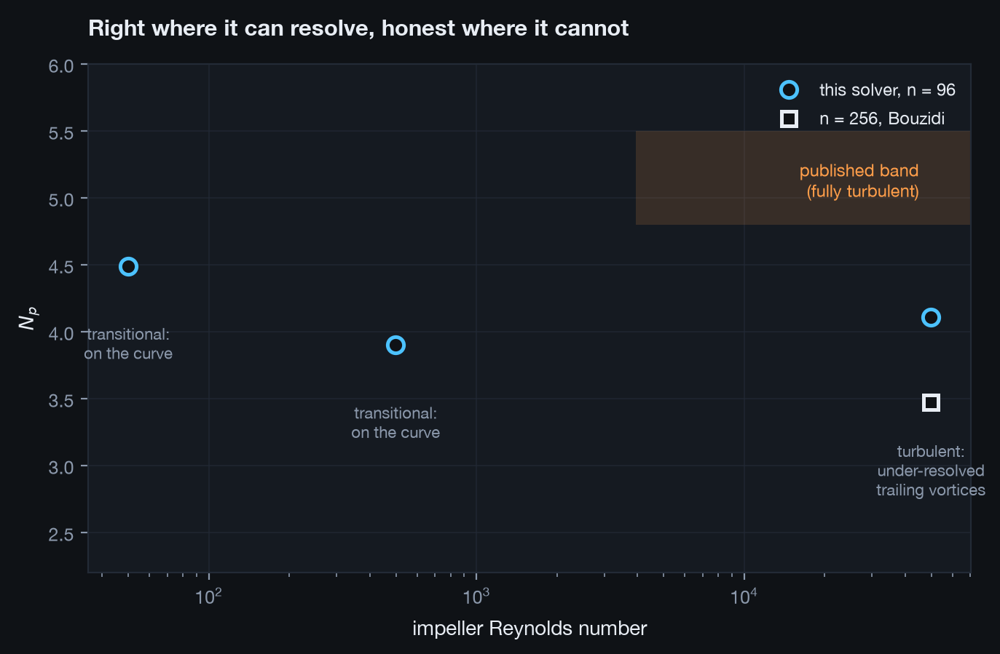
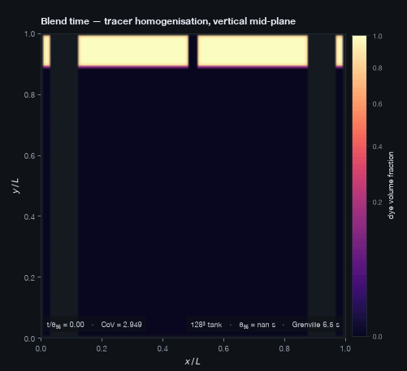
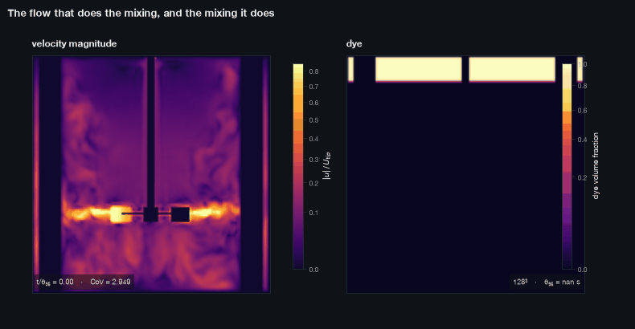
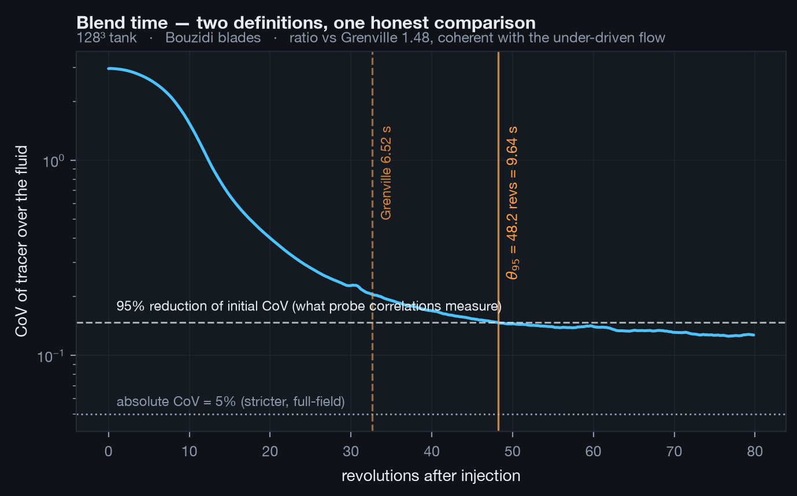

# Phase 2 — A stirred tank, and the anatomy of an honest miss

Phase 1 ended with a fast, verified 3D solver that contained no geometry. Phase 2 put
the tank in it: vessel, baffles, a rotating six-blade Rushton, torque measurement, and
a passive tracer — the first end-to-end path from a YAML case file to the numbers a
process engineer asks for.

The headline results, stated plainly:

| quantity | measured | target | verdict |
|---|---|---|---|
| $N_p$, Re = 50 | 4.49 | transitional curve | **on the curve** |
| $N_p$, Re = 500 | 3.90 | transitional curve | **on the curve** |
| $N_p$, Re = 5×10⁴ | 3.47 (n = 256, Bouzidi) | 4.8–5.5 | **28% below the band** |
| $\theta_{95}$ blend | 9.64 s | Grenville 6.52 s | ratio 1.48 |

The fully turbulent power number was missed, and this document is largely the anatomy
of that miss: eleven suspects measured and eliminated one at a time, a momentum ledger
built to audit the torque meter (which caught a real meter bug), and a final quantified
statement of what the miss is — under-resolved trailing-vortex turbulence, with the
band arriving near n ≈ 1000, out of reach on this hardware. The two misses are one
physics deficit: an under-driven flow circulates and blends slowly in the same
proportion.

That trail is worth more than a first-try land in the band would have been. It is the
difference between a solver whose numbers happen to be right and one whose numbers can
be *defended*.

---

## 1. The main ideas

### The standard tank is parametric, so no STL was written

`phase0.md` promised Phase 2 as "STL voxelisation + immersed boundary". Neither was
built, deliberately: the vessel is a cylinder, the baffles are boxes, and the Rushton
is a disc, hub, shaft and six flat plates — every dimension already in the schema.
`trimesh` remains uninstalled. STL import waits for a custom-geometry case that
actually needs it, the same measure-first discipline that kept MRT unwritten in
Phase 1.

### The blades are a function, not a mask

Rotation means the solid set changes every step. Instead of re-voxelising, the kernel
evaluates `solid(x, t)` analytically per node: fold the node's polar angle into the
nearest blade's sector, one sin/cos regardless of blade count. No mask updates, no
host traffic, and the NumPy voxeliser in `geometry/tank.py` is the oracle — the
in-kernel test reproduces it **exactly, zero mismatched cells** in fp64, at any angle.

The axisymmetric parts (disc, hub, shaft) rotate without changing shape, so they live
in the static solid field with a static wall velocity — machinery verified since
Phase 1a. Only the blades are dynamic, which confines the fresh-node problem to the
blade-swept band.

### Sub-cell walls from exact geometry

Bouzidi interpolated bounce-back needs the wall's fraction q along each boundary link.
Because each blade is an axis-aligned box *in its own frame*, q is an exact ray–box
intersection computed on the fly — closed form, no per-link storage, verified against
brute-force bisection of the membership function itself (zero mismatches beyond 10⁻⁶
on hundreds of random links). At n = 128 the Bouzidi blade finally matches the lab
impeller the published band describes: t/D = 2.3%, walls at their true positions,
torque ripple halved.

### Instruments before conclusions

The deepest lesson of the phase. When the Bouzidi torque meter read several times the
plausible value, the temptation was to patch formulas until the number looked right.
Instead the phase built the **momentum ledger**: every channel of angular momentum
into or out of the resolved fluid metered independently — impeller links, static
walls, refill injection — and the budget demanded to close against dL/dt computed
from the fields. The ledger found the bug in an afternoon (§4), and every torque
number since is instrument-audited rather than plausible-looking.

---

## 2. Setup

`scripts/run_case.py` is the path: YAML → `LatticeScales` (unit bridge, round-trip
tested) → `Tank` (voxelisation) → `D3Q19Solver` (rotor, regularized collision, LES) →
torque history → $N_p$. The milestone case runs 4,643 steps per revolution at n = 128
and 278 MLUPS at n = 256 — about 3.7 hours for the finest run in this document.

Torque logs into a device-side ring drained in chunks: reading the accumulator every
step costs a pipeline sync per step, measured at 6× total slowdown before the fix.
The ring asserts loudly if it ever wraps unread rather than silently biasing the
average.

The tracer is a D3Q7 advection–diffusion lattice riding the flow solver's own fields
by reference (no copies, no host traffic), with per-cell diffusivity
ν/Sc + ν_t/Sc_t. It was validated standalone against closed forms before touching the
tank: Gaussian diffusion within 0.35% of 2Dt, advection centroid exact to four
decimals, and its own numerical diffusion *measured* (≈10⁻⁴ at tip speed) rather than
assumed away.

---

## 3. Results

### The tank



Vertical mid-plane at n = 256, Bouzidi blades, Re = 49,900. The radial discharge jet,
the trailing-vortex cores either side of the blade, and turbulent structure through
the bulk. Rendered in the Phase 2 visual overhaul: `EMBER` (inferno lifted off its
black foot, so nothing dissolves into the dark canvas) and direct image rendering
(contourf posterises and blurs dense turbulent fields).





The vertical plane and the impeller plane, torque in the caption — the spin-up is
visible as the torque settling.

### The power number



Both boundary treatments rise ~+0.5 per resolution doubling above n = 128 and neither
is near converged. Extrapolating the trend puts the band near **n ≈ 1000** — roughly
135 GB of fields and weeks per run on this machine. That is the quantified cost of the
fully turbulent milestone, and the honest content of the miss.



The same solver, same geometry, same meter sits **on the plausible published curve at
Re = 50 and Re = 500**. The deficit exists only where the trailing-vortex system —
the structure that sets fully turbulent Rushton drag — outruns the affordable
resolution. The machine is right in the regime it can resolve.

### The blend





The dye-and-stopwatch experiment, and the synchronised speed-beside-dye two-panel —
different quantities on deliberately different colormaps and separate scales.



θ₉₅ = 9.64 s against Grenville's 6.52 s, ratio 1.48, using the definition the
correlation was fitted to (95% reduction of initial CoV). The first blend run
"failed" for eighteen GPU-minutes because the script enforced the *absolute* CoV < 5%
definition — a factor-2 units mismatch between definitions, caught before it became a
reported error. Note the circularity guard: Grenville here is fed our own measured
$N_p$; fed the band's midpoint instead, the ratio worsens to ~1.7, consistent with
the same under-driven flow.

---

## 4. Verification and validation

### Taylor–Couette, before any impeller existed

The two new error sources of the phase — staircase curved walls and the
momentum-exchange torque — were validated against closed forms first: profile error
≤ 1.6% and torque error ≤ 2.21% across the ladder, worst case, with the analytic
torque $T = 4\pi\mu L\Omega R_1^2R_2^2/(R_2^2-R_1^2)$ as the reference. Everything
the power number later depended on had an exact answer behind it.

### The momentum ledger, and the meter bug it caught

The ledger demands
$\Delta L = -\int T_{imp} - \int T_{static} + \text{inject}$
close against the field-computed angular momentum. First audit: it refused to close,
and the decomposition localised the error to the **+2W isotropic pressure background**
in the link exchange — per link ~100× the physical signal, net torque on a closed
body exactly zero in the continuum, but not closing on a rotated blade's staircase
link set. Roughly *two links' worth* of systematic imbalance read as 3–6× the true
torque. On halfway's near-axisymmetric link sets it self-cancels, which is why
Couette and every static case had validated perfectly and the term looked innocent.

Dropping the gauge term (uniform pressure exerts no net force or torque on a closed
rigid body — pure gauge, no physics):

| budget | residual |
|---|---|
| halfway, n = 48, 100 steps | **4.4%** |
| Bouzidi, same window | **17.2%** |

The defect test that documented the broken meter passed on the next suite run and is
promoted to a hard assertion. Every Bouzidi torque number that predates the audit is
superseded.

A second ledger lesson, kept as a comment where the code used to be: **coverage is
not a channel**. Metering the momentum a blade "swallows" when covering a fluid node
double-books ~the entire impeller torque — under halfway the covered node returns it
a step later (inventory, not flux); under Bouzidi the loss is already inside the
one-sided link meter.

### The operator referee

| operator | Re 499 | Re 50 (Cs = 0) | ripple |
|---|---|---|---|
| regularized | 3.90 | 4.49 | 0.44 |
| BGK | 4.03 | **4.47** | 0.49 |
| TRT | 8.76 | 5.08 | 0.86 |

BGK — textbook, run in its comfortable regime — agrees with regularized to **0.4%**.
TRT is the noisy outlier everywhere and diverges outright at tank conditions: the
operator that carried Phases 0–1 on smooth static walls is the wrong one around a
rotating impeller, its plane-wall magic parameter doing nothing for ghost modes
excited by staircase blades and fresh-node refills.

### The eliminated-suspect table

The turbulent-regime deficit, with every suspect and its execution:

| suspect | test | verdict |
|---|---|---|
| resolution (staircase) | ladder n = 64→256 | rises too slowly; not the cause alone |
| blade thickness | ±plate cells at fixed n | real lever (−0.5/cell), wrong sign for the trend |
| Smagorinsky Cs | 0.05 / 0.10 / 0.15 | flat (2%) |
| effective Re | ν_t/ν metered every run | turbulent plateau throughout |
| Galilean exchange term | corrected formula | cancels pairwise on plates; no-op |
| Mach | 0.05 → 0.025 | +2.4%, within noise |
| fp32 | fp64 CPU control | 3.56 vs 3.55 |
| wall placement | Bouzidi, exact q | faithful geometry; deficit persists |
| torque meter | momentum ledger | bug found, fixed, budget closes |
| coverage bookkeeping | ledger | not a channel; double-books |
| collision operator | BGK referee | regularized exonerated to 0.4% |

What remains standing: resolution of the turbulent trailing-vortex system — the
literature's known-hard part of this exact problem, historically solved with
finer grids plus forcing-based impellers.

### Geometry oracles

Kernel blade mask vs NumPy voxeliser: exact in fp64 at every tested angle. Bouzidi q
vs bisection of the membership function: zero mismatches beyond 10⁻⁶. Blade voxel
count oscillates 704→496 with angle at n = 128 under halfway — the staircase ripple
that Bouzidi's exact walls then halve.

---

## 5. Test suite

184 tests, ~30 s. The ones this phase leans on:

- **Geometry oracles** — mask equality in fp64, q against bisection, voxel volumes
  converging on analytic values, n-fold symmetry of the impeller mask.
- **Couette** — analytic profile and torque, the meter's exact-answer anchor.
- **The meter balances angular momentum** — the ledger's closure as a hard assertion;
  an xfail for exactly one commit, documenting the defect until the fix landed.
- **Rotor physics** — torque resists rotation, mass drift bounded (< 0.1% per quarter
  revolution), flow finite through many blade sweeps, device torque log equal to
  per-step reads.
- **Scalar closed forms** — diffusion rate, exact advection, conservation against
  walls to fp64 round-off.

---

## 6. Honest limitations, and what was wrong along the way

- **The fully turbulent $N_p$ was missed**, by 28% at the best feasible
  configuration, with the resolution requirement quantified rather than waved at.
- **The Bouzidi meter was broken for a day** and read 3–6× reality; every number it
  produced pre-audit is garbage, superseded, and said so in the commit history.
- **The first blend run threw away its evidence** — the script exited on a missed
  endpoint before saving the frames that showed why. Fixed: save first, verdict
  after.
- **A factor-2 blend "error" was nearly manufactured** by comparing an absolute-CoV
  definition against a reduction-fitted correlation — the same class of mistake as
  Phase 1's fp32 residual floor: a healthy result labelled a failure by an
  unreachable criterion.
- **The static impeller parts still use halfway bounce-back**; only the blades got
  Bouzidi. Disc edge staircase remains, bounded by the Couette numbers.
- **The lid is rigid no-slip**; a baffled tank at Fr ≈ 0.25 has no vortex and the
  literature puts the effect at a few percent, but it is an approximation, not a fact.
- **Scalar approximations, stated**: Sc_t = 0.7 closure (Sc = 1000 unresolvable —
  Batchelor scale 32× below Kolmogorov), blades transparent to the tracer (1–2% of
  volume), lattice numerical diffusion comparable to modelled ν_t/Sc_t in the quiet
  bulk.
- **The trailing-vortex explanation is the last suspect standing, not a proven
  cause.** Proving it needs either n ≈ 1000, or a forcing-based impeller experiment,
  or grid refinement local to the blades — all Phase 3+ material.

---

## 7. What Phase 2 establishes for Phase 3

| asset | why it matters next |
|---|---|
| YAML → numbers path | the contract the AI setup agent will fill, now real |
| Audited torque instrument | any future boundary scheme inherits a closing budget |
| Analytic rotor + Bouzidi q | extends to any parametric impeller (PBT, hydrofoil) |
| Momentum ledger | the debugging instrument, reusable for any new physics |
| Operator verdict | regularized is the tank operator; TRT retired from geometry |
| Scalar lattice | any passive quantity: tracers, heat (with a source term) |
| Quantified resolution wall | the concrete case for cloud GPU / AA streaming / local refinement |

Phase 3's opening question is written by this phase's ending: the fully turbulent
milestone needs either more resolution than this machine has (AA streaming halves
memory; a cloud A100/H100 run is now a justified, costed experiment rather than a
guess) or a forcing-based impeller of the kind the literature used at exactly this
juncture. Both paths start from an instrument-audited baseline.

---

## Reproducing

```bash
pip install -e ".[gpu,dev]"

pytest -q -m "not slow"                                        # 184 tests, ~30 s

python scripts/validate_couette.py                             # analytic profile + torque
python scripts/audit_ledger.py --n 48                          # the budget must close
python scripts/run_case.py cases/examples/rushton_standard.yaml \
    --n 128 --boundary bouzidi                                 # ~25 min -> Np
python scripts/blend_time.py cases/examples/rushton_standard.yaml \
    --n 128 --max-revs 80                                      # ~65 min -> theta_95
python scripts/animate_tank.py runs/tank/tank_rushton_standard_lab_n128_bouzidi.npz
```

Figures land in `runs/` (gitignored); the curated set is in `docs/figures/`.

### References

Bouzidi, M., Firdaouss, M. & Lallemand, P. (2001). Momentum transfer of a Boltzmann-
lattice fluid with boundaries. *Phys. Fluids* **13**, 3452–3459.

Grenville, R. K. (1992). *Blending of viscous Newtonian and pseudo-plastic fluids.*
PhD thesis, Cranfield Institute of Technology. (Correlation as transcribed in
`reference.py` in Phase 0.)

Latt, J. & Chopard, B. (2006). Lattice Boltzmann method with regularized pre-collision
distribution functions. *Math. Comput. Simul.* **72**, 165–168.
